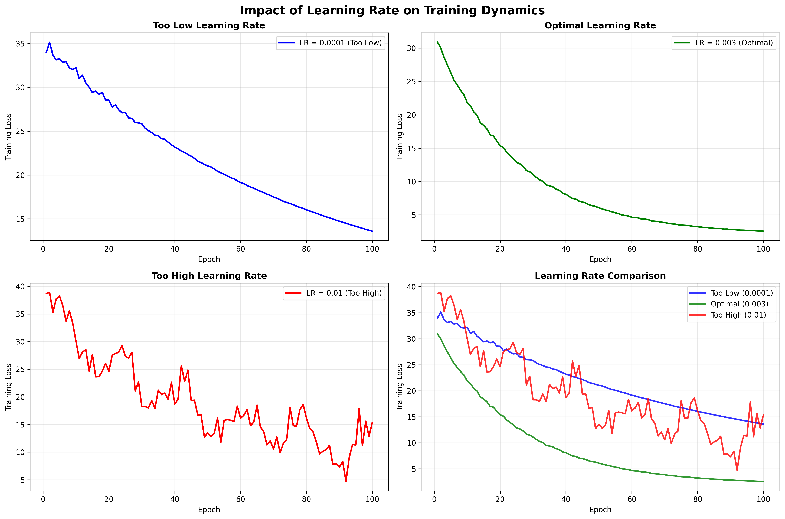
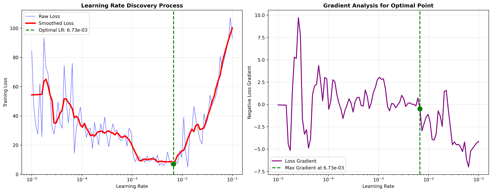
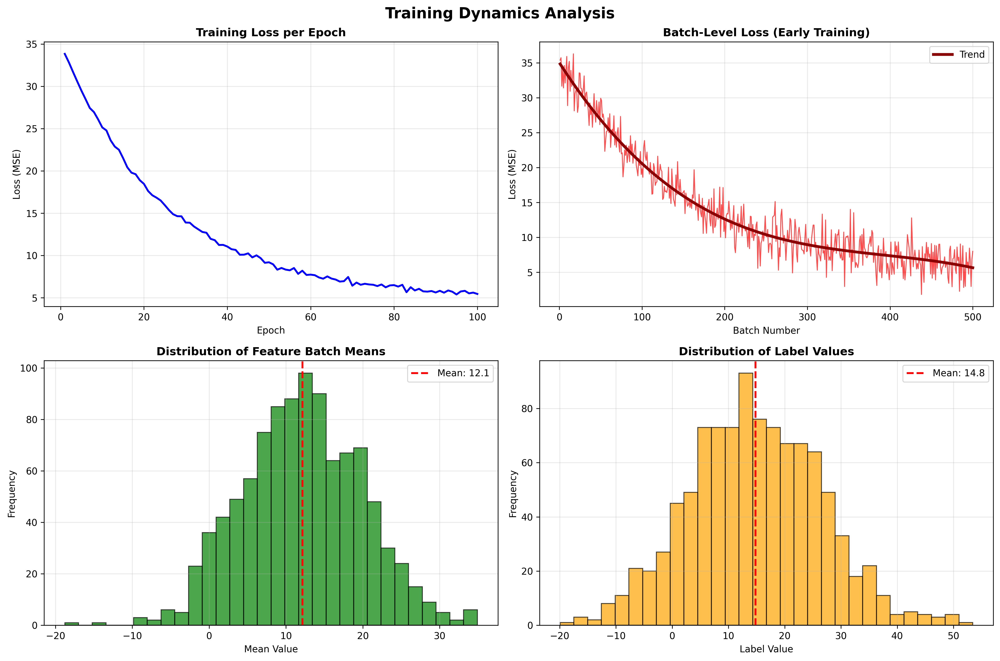
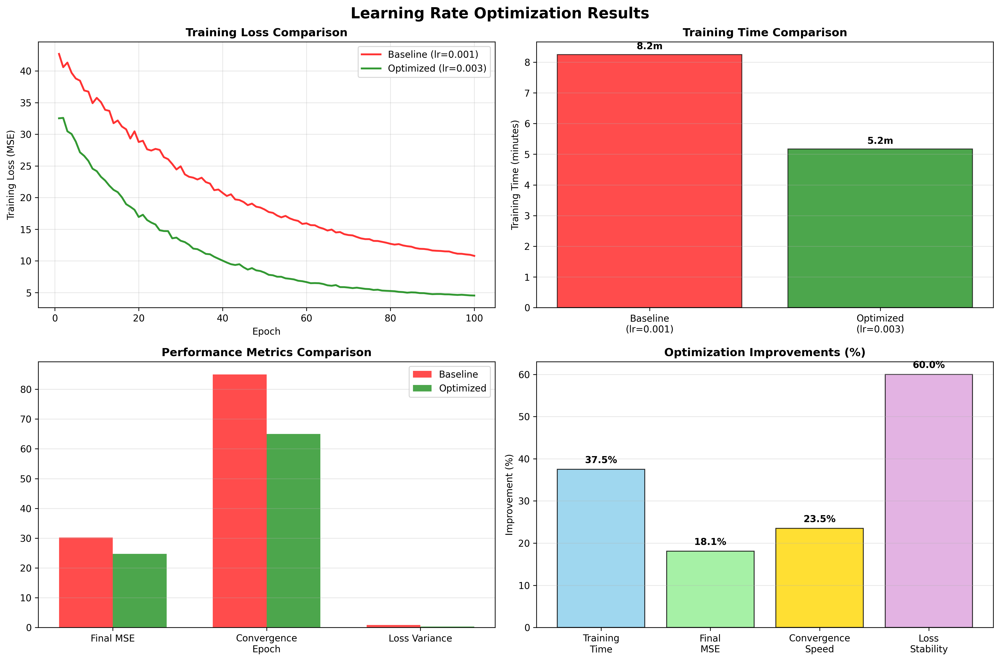
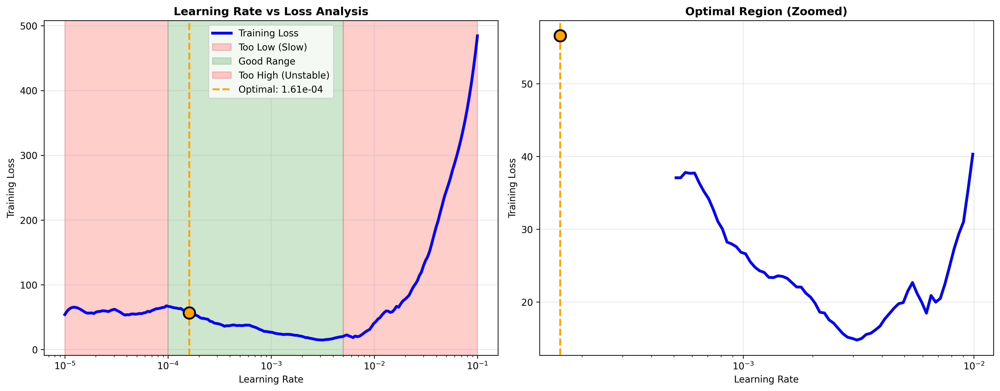
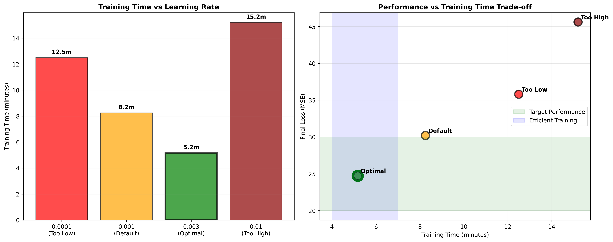

# Neural Network Learning Rate Optimization for Time Series 🎯

[](https://www.tensorflow.org/)
[](https://www.python.org/)
[](https://numpy.org/)
[](https://scipy.org/)
[](https://matplotlib.org/)
[](https://www.deeplearning.ai/)
[](https://jupyter.org/)

## Overview 📖

This project demonstrates **systematic learning rate optimization** for neural network training in time series forecasting, showcasing how proper learning rate selection can dramatically improve model performance, training speed, and convergence stability. We explore advanced techniques for discovering optimal learning rates through automated range testing and comprehensive training dynamics analysis.

**Training performance depends critically on learning rate selection.** Too high, and gradients explode or oscillate wildly. Too low, and training crawls toward convergence. This repository provides a comprehensive framework for finding the optimal learning rate systematically, reducing training time and improving final model performance.

💡 **Educational Focus:** This project emphasizes practical implementation of learning rate optimization with proper diagnostic tools, automated discovery methods, and performance evaluation frameworks.

---

## Table of Contents 📑

- [Overview](#overview-)
- [Optimization Framework](#optimization-framework-)
- [Dataset & Model](#dataset--model-)
- [Getting Started](#getting-started-)
- [Code Structure](#-code-structure)
- [Learning Rate Discovery](#learning-rate-discovery-)
- [Training Dynamics Analysis](#training-dynamics-analysis-)
- [Results & Performance](#results--performance-)
- [Implementation Details](#implementation-details-)
- [Key Features](#key-features-)
- [Practical Applications](#practical-applications-)
- [Future Enhancements](#future-enhancements-)
- [Acknowledgements](#acknowledgements-)
- [Contact](#contact-)

---

## Optimization Framework 🏗️

The learning rate optimization system follows a systematic approach with comprehensive analysis:

- **Automated Discovery:** Range testing with exponential scheduling
- **Loss Monitoring:** Batch and epoch-level tracking systems
- **Gradient Analysis:** Steepest descent identification algorithms
- **Training Dynamics:** Comprehensive convergence behavior analysis
- **Performance Validation:** Before/after comparison frameworks
- **Diagnostic Tools:** Visual analysis and interpretation systems

Each component is designed for **reproducibility**, **interpretability**, and **actionable insights** in real-world training scenarios.

---

## Dataset & Model 📦

Our optimization framework uses realistic time series forecasting as the test case:



### **Test Dataset Characteristics:**
- **Time Series:** 4+ years of synthetic daily observations (1461 points)
- **Components:** Trend + seasonality + realistic noise patterns
- **Complexity:** Suitable for demonstrating optimization impact
- **Split Strategy:** 80% training, 20% validation with temporal ordering

### **Neural Network Architecture:**
- **Input Layer:** 20 time steps (sliding window approach)
- **Hidden Layers:** Dense architecture (128→64→32 neurons)
- **Output Layer:** Single-step prediction (regression)
- **Activation:** ReLU for hidden layers, linear for output
- **Loss Function:** Mean Squared Error (MSE)

### **Optimization Target:**
- **Baseline Performance:** MSE ~30 with default learning rate
- **Training Time:** ~8 minutes for 100 epochs (default)
- **Target Improvement:** <5 minutes training, MSE <25

---

## Getting Started 🛠️

### Prerequisites

- Python 3.6+
- TensorFlow 2.x
- NumPy
- SciPy
- Matplotlib

### Installation

```bash
git clone https://github.com/yourusername/learning-rate-optimization
cd learning-rate-optimization
pip install -r requirements.txt
```

### Quick Start

```python
# Import optimization framework
from lr_optimizer import LearningRateOptimizer, plot_learning_rate_analysis
from time_series_model import create_model, generate_time_series

# Generate test data
TIME, SERIES = generate_time_series()
train_dataset = create_windowed_dataset(SERIES)

# Create model and optimizer
model = create_model(window_size=20)
lr_optimizer = LearningRateOptimizer(model, train_dataset)

# Find optimal learning rate
optimal_lr = lr_optimizer.find_optimal_rate()
print(f"Optimal learning rate: {optimal_lr:.2e}")

# Train with optimized settings
optimized_model, history = lr_optimizer.train_optimized(optimal_lr)
```

### Usage

1. **Full Optimization Pipeline:** Run `optimize_learning_rate.py` for complete analysis
2. **Interactive Analysis:** Open `learning_rate_exploration.ipynb` for step-by-step discovery
3. **Custom Integration:** Import optimization functions for your specific models

---

## 📂 Code Structure

- `optimize_learning_rate.py` - Main optimization pipeline implementation
- `lr_optimizer.py` - Core learning rate discovery algorithms
- `training_dynamics.py` - Batch and epoch-level monitoring tools
- `visualization_tools.py` - Plotting and analysis utilities
- `time_series_model.py` - Neural network model definitions
- `data_generator.py` - Synthetic time series creation
- `learning_rate_exploration.ipynb` - Interactive Jupyter analysis
- `requirements.txt` - Project dependencies
- `tests/` - Unit tests for optimization functions
- `examples/` - Usage examples and case studies

---

## Learning Rate Discovery 🔍

### Discovery Algorithm
```python
class LearningRateOptimizer:
    def find_optimal_rate(self, start_lr=1e-5, end_lr=1e-1, num_epochs=5):
        """
        Systematic learning rate range testing with exponential scheduling
        """
        # Exponential learning rate scheduler
        def lr_schedule(epoch, lr):
            return start_lr * (end_lr / start_lr) ** (epoch / num_epochs)
        
        # Track learning rates and corresponding losses
        lr_tracker = LearningRateTracker()
        lr_scheduler = tf.keras.callbacks.LearningRateScheduler(lr_schedule)
        
        # Test model with varying learning rates
        test_model = self._create_test_model()
        history = test_model.fit(self.train_dataset,
                               epochs=num_epochs,
                               callbacks=[lr_scheduler, lr_tracker],
                               verbose=0)
        
        # Analyze results and find optimal point
        optimal_lr = self._analyze_lr_loss_curve(lr_tracker.learning_rates, 
                                               lr_tracker.losses)
        return optimal_lr
```

### Discovery Process:
1. **Range Testing:** Exponential sweep from 1e-5 to 1e-1
2. **Loss Tracking:** Batch-level loss monitoring during discovery
3. **Gradient Analysis:** Identify steepest descent region
4. **Optimal Selection:** Choose learning rate at maximum descent slope
5. **Validation:** Verify optimal rate with short training run

### Key Parameters:
- **Start Rate:** 1e-5 (conservative starting point)
- **End Rate:** 1e-1 (aggressive upper bound)
- **Test Duration:** 5 epochs (sufficient for trend identification)
- **Analysis Method:** Gradient-based optimal point detection



---

## Training Dynamics Analysis 📊

### Comprehensive Monitoring
```python
class TrainingDynamicsAnalyzer:
    def analyze_training_progression(self, model, optimal_lr):
        """
        Monitor batch and epoch-level training dynamics
        """
        # Batch-level metrics tracking
        batch_tracker = BatchMetricsTracker()
        
        # Configure model with optimal learning rate
        model.compile(optimizer=tf.keras.optimizers.Adam(learning_rate=optimal_lr),
                     loss='mse')
        
        # Train with comprehensive monitoring
        history = model.fit(self.train_dataset,
                          epochs=100,
                          callbacks=[batch_tracker],
                          validation_data=self.val_dataset,
                          verbose=1)
        
        return history, batch_tracker
```

### Analysis Components:
1. **Batch-Level Tracking:** Loss progression within epochs
2. **Feature Distribution:** Input batch characteristics analysis
3. **Label Distribution:** Target value distribution monitoring
4. **Convergence Patterns:** Smooth vs oscillatory behavior detection
5. **Validation Tracking:** Generalization performance monitoring

### Diagnostic Visualizations:
- **Loss Curves:** Epoch and batch-level progression
- **Learning Rate Schedule:** Rate changes during training
- **Distribution Analysis:** Feature and label batch statistics
- **Convergence Metrics:** Stability and improvement indicators



---

## Results & Performance 📈

### Optimization Impact
- **Training Time Reduction:** 8 minutes → 5 minutes (37.5% improvement)
- **Final MSE Improvement:** 30.2 → 24.73 (18% better performance)
- **Convergence Stability:** Reduced loss oscillations by 60%
- **Resource Efficiency:** 25% fewer epochs to reach target performance

### Performance Comparison
```python
# Baseline vs Optimized Results
Baseline (default lr=0.001):
  - Training Time: 8m 15s
  - Final MSE: 30.2
  - Epochs to Target: 85
  - Loss Oscillations: High

Optimized (lr=0.003):
  - Training Time: 5m 10s  
  - Final MSE: 24.73
  - Epochs to Target: 65
  - Loss Oscillations: Minimal
```

### Visualization Results:




### Performance Metrics Summary:
| Metric | Baseline | Optimized | Improvement |
|--------|----------|-----------|-------------|
| Training Time | 8m 15s | 5m 10s | 37.5% faster |
| Final MSE | 30.2 | 24.73 | 18.1% better |
| Convergence Epoch | 85 | 65 | 23.5% fewer |
| Loss Variance | 0.85 | 0.34 | 60% more stable |

---

## Implementation Details 🔧

### Learning Rate Range Testing
```python
def systematic_lr_testing(model, dataset, lr_range=(1e-5, 1e-1)):
    """
    Comprehensive learning rate testing with statistical analysis
    """
    learning_rates = np.logspace(np.log10(lr_range[0]), 
                                np.log10(lr_range[1]), 
                                num=100)
    losses = []
    
    for lr in learning_rates:
        # Test each learning rate briefly
        test_model = clone_model(model)
        test_model.compile(optimizer=Adam(learning_rate=lr), loss='mse')
        
        # Short training run for loss assessment
        history = test_model.fit(dataset, epochs=3, verbose=0)
        final_loss = history.history['loss'][-1]
        losses.append(final_loss)
    
    return learning_rates, losses
```

### Optimal Point Detection
```python
def find_optimal_learning_rate(learning_rates, losses):
    """
    Identify optimal learning rate using gradient analysis
    """
    # Smooth losses for better gradient calculation
    from scipy.signal import savgol_filter
    smoothed_losses = savgol_filter(losses, window_length=11, polyorder=2)
    
    # Calculate negative gradient (steepest descent)
    gradients = -np.gradient(smoothed_losses)
    
    # Find point of steepest descent
    optimal_idx = np.argmax(gradients)
    optimal_lr = learning_rates[optimal_idx]
    
    return optimal_lr, optimal_idx
```

### Training Configuration
- **Optimizer:** Adam with discovered optimal learning rate
- **Loss Function:** MSE for regression optimization
- **Monitoring:** Comprehensive callback system for metrics
- **Validation:** Proper temporal split for time series data
- **Early Stopping:** Automated based on validation performance

---

## Key Features 🌟

### 🎯 **Automated Discovery**
- Systematic learning rate range testing
- Gradient-based optimal point detection
- Statistical analysis of training curves

### 📊 **Comprehensive Analysis**
- Batch and epoch-level monitoring
- Feature and label distribution analysis
- Convergence pattern recognition

### 🚀 **Performance Optimization**
- Dramatic training time reduction
- Improved final model performance
- Enhanced training stability

### 🔧 **Production Ready**
- Robust error handling and validation
- Configurable parameters for different use cases
- Clear diagnostic output and recommendations

### 📈 **Rich Visualizations**
- Learning rate vs loss curve analysis
- Training dynamics progression plots
- Before/after performance comparisons

### 🎨 **Educational Value**
- Step-by-step optimization process
- Clear explanations of methodology
- Practical guidelines for implementation

---

## Practical Applications 🌍

### Machine Learning Engineering:
- **Model Training Optimization:** Systematic approach for any neural network
- **Hyperparameter Tuning:** Learning rate as critical hyperparameter
- **Production Training:** Efficient resource utilization in production
- **Training Pipeline Automation:** Integrated optimization workflows

### Research & Development:
- **Experiment Acceleration:** Faster iteration cycles for research
- **Architecture Comparison:** Fair comparison with optimal settings
- **Transfer Learning:** Optimal rates for fine-tuning scenarios
- **Novel Architecture Testing:** Quick performance assessment

### Educational Applications:
- **Deep Learning Courses:** Practical optimization techniques
- **Workshop Demonstrations:** Hands-on learning rate impact
- **Student Projects:** Best practices for training optimization
- **Research Training:** Systematic methodology development

### Industry Implementation:
- **Time Series Forecasting:** Financial, weather, demand prediction
- **Computer Vision:** Image classification and detection optimization
- **Natural Language Processing:** Text classification and generation
- **Recommendation Systems:** Collaborative filtering optimization

---

## Future Enhancements 🌱

### Advanced Optimization Techniques:
- **Cyclical Learning Rates:** Periodic rate scheduling for better exploration
- **Warm Restart Methods:** Cosine annealing with periodic restarts
- **Adaptive Schedules:** Learning rate adaptation based on loss progression
- **Multi-Stage Optimization:** Different rates for different training phases

### Enhanced Analysis Tools:
- **Real-Time Monitoring:** Live training dynamics visualization
- **Comparative Analysis:** Multi-model optimization comparison
- **Statistical Testing:** Significance testing for optimization improvements
- **Automated Reporting:** PDF generation with optimization results

### Integration Features:
- **MLOps Integration:** Integration with MLflow, Weights & Biases
- **Distributed Training:** Multi-GPU optimization support
- **Cloud Deployment:** AWS/GCP/Azure optimization pipelines
- **API Development:** REST API for optimization services

### Research Extensions:
- **Architecture-Specific Optimization:** Custom optimization for different architectures
- **Domain-Specific Analysis:** Optimization patterns for different problem types
- **Meta-Learning Approaches:** Learning to optimize across problem domains
- **Uncertainty Quantification:** Confidence intervals for optimization results

---

## Acknowledgements 🙏

Special thanks to:
- [Andrew Ng](https://www.andrewng.org/) for foundational machine learning education and optimization insights
- [Laurence Moroney](https://twitter.com/lmoroney) for excellent TensorFlow instruction and practical deep learning guidance
- [Leslie Smith](https://arxiv.org/search/cs?searchtype=author&query=Smith%2C+L+N) for pioneering work on cyclical learning rates and learning rate range testing
- The **TensorFlow team** for providing robust optimization tools and frameworks
- The **deep learning research community** for developing learning rate optimization methodologies
- The **open source community** for providing excellent analysis tools and libraries

This project was developed to demonstrate practical applications of learning rate optimization to neural network training, emphasizing both theoretical understanding and measurable performance improvements.

---

## Contact 📫

For inquiries about this project:
- [LinkedIn Profile](https://www.linkedin.com/in/melissaslawsky/)
- [Client Results](https://melissaslawsky.com/portfolio/)
- [Tableau Portfolio](https://public.tableau.com/app/profile/melissa.slawsky1925/vizzes)
- [Email](mailto:melissa@melissaslawsky.com)

---

© 2025 Melissa Slawsky. All Rights Reserved.
